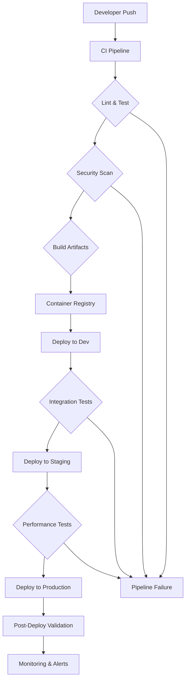
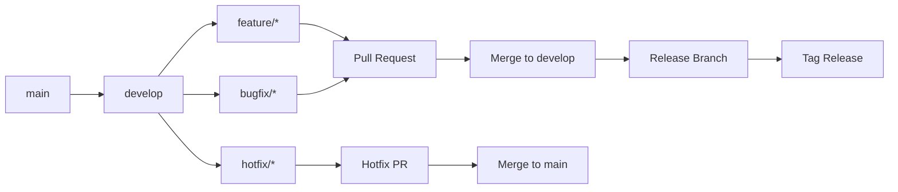

# TaskFlow CI/CD Pipeline Documentation

## Table of Contents

1. [Overview](#overview)
2. [CI/CD Strategy and Architecture](#cicd-strategy-and-architecture)
3. [Pipeline Stages](#pipeline-stages)
4. [GitHub Actions Workflows](#github-actions-workflows)
5. [GitLab CI/CD](#gitlab-cicd)
6. [Jenkins Pipeline](#jenkins-pipeline)
7. [Testing Strategy](#testing-strategy)
8. [Security Scanning](#security-scanning)
9. [Deployment Strategies](#deployment-strategies)
10. [Environment Management](#environment-management)
11. [Monitoring and Alerting](#monitoring-and-alerting)
12. [Rollback Procedures](#rollback-procedures)
13. [Performance Optimization](#performance-optimization)
14. [Troubleshooting](#troubleshooting)

---

## Overview

This document outlines the comprehensive CI/CD pipeline for TaskFlow, a full-stack task management application. The pipeline ensures automated testing, security scanning, and reliable deployments across multiple environments.

### Key Features

- **Automated Testing**: Unit, integration, and end-to-end tests
- **Security Scanning**: Container, dependency, and code security checks
- **Multi-Platform Deployment**: Docker, Kubernetes, cloud platforms
- **Environment Management**: Development, staging, production
- **Monitoring Integration**: Real-time metrics and alerting
- **Rollback Capabilities**: Automated and manual rollback procedures

### Technology Stack

- **Backend**: NestJS (Node.js/TypeScript)
- **Frontend**: Next.js (React/TypeScript)
- **Databases**: PostgreSQL, MongoDB, Redis
- **Infrastructure**: Docker, Kubernetes
- **CI/CD Platforms**: GitHub Actions, GitLab CI, Jenkins
- **Cloud Platforms**: AWS, GCP, Azure

---

## CI/CD Strategy and Architecture

### Pipeline Philosophy

Our CI/CD strategy follows these core principles:

1. **Fail Fast**: Catch issues early in the pipeline
2. **Immutable Artifacts**: Build once, deploy everywhere
3. **Infrastructure as Code**: All infrastructure changes are versioned
4. **Security First**: Security checks integrated throughout the pipeline
5. **Observability**: Comprehensive monitoring and logging

### Architecture Overview



### Environment Strategy

| Environment | Purpose | Deployment Frequency | Data Persistence |
|-------------|---------|---------------------|------------------|
| **Development** | Feature development and testing | Multiple times daily | Ephemeral |
| **Staging** | Integration testing and UAT | Daily | Persistent (subset) |
| **Production** | Live application | Weekly/Monthly | Full persistence |

---

## Pipeline Stages

### 1. Source Code Management

#### Branching Strategy



#### Commit Conventions

We follow conventional commits for automated versioning and changelog generation:

```bash
# Feature commits
feat: add user authentication system
feat(backend): implement JWT token refresh

# Bug fixes
fix: resolve memory leak in task processor
fix(frontend): correct date picker validation

# Breaking changes
feat!: migrate to new database schema

# Other types
docs: update API documentation
test: add unit tests for user service
refactor: optimize database queries
```

### 2. Build Stage

#### Docker Multi-Stage Builds

```dockerfile
# Build stage
FROM node:18-alpine AS builder

WORKDIR /app
COPY package*.json ./
RUN npm ci --only=production

COPY . .
RUN npm run build

# Production stage
FROM node:18-alpine AS production

RUN apk add --no-cache dumb-init
RUN addgroup -g 1001 -S nodejs
RUN adduser -S nestjs -u 1001

WORKDIR /app
COPY --from=builder /app/dist ./dist
COPY --from=builder /app/node_modules ./node_modules

USER nestjs
EXPOSE 3000

HEALTHCHECK --interval=30s --timeout=3s --start-period=5s --retries=3 \
  CMD node -e "require('http').get('http://localhost:3000/health', (res) => { process.exit(res.statusCode === 200 ? 0 : 1) })"

ENTRYPOINT ["dumb-init", "--"]
CMD ["node", "dist/main.js"]
```

#### Build Optimization

- **Layer Caching**: Maximize Docker layer reuse
- **Parallel Builds**: Build frontend and backend simultaneously
- **Artifact Caching**: Cache dependencies and build artifacts
- **Multi-Architecture**: Support ARM64 and AMD64 builds

### 3. Testing Stage

#### Test Categories

| Test Type | Scope | Execution Time | Environment |
|-----------|-------|----------------|-------------|
| **Unit Tests** | Individual functions/components | < 2 minutes | Local |
| **Integration Tests** | API endpoints, database operations | < 5 minutes | Docker |
| **E2E Tests** | Full user workflows | < 10 minutes | Docker |
| **Performance Tests** | Load testing, stress testing | < 15 minutes | Staging |
| **Security Tests** | Vulnerability scanning | < 5 minutes | Docker |

#### Test Automation

```yaml
# Jest configuration for backend
test:ci:
  stage: test
  script:
    - npm run test:cov
  coverage: '/All files[^|]*\|[^|]*\s+([\d\.]+)/'
  artifacts:
    reports:
      coverage_report:
        coverage_format: cobertura
        path: coverage/cobertura-coverage.xml
    expire_in: 1 week

# Playwright E2E tests
e2e:test:
  stage: test
  script:
    - npm run test:e2e
  artifacts:
    when: always
    paths:
      - test-results/
      - playwright-report/
    expire_in: 1 week
```

### 4. Security Scanning

#### Container Security

```yaml
# Trivy container scanning
container:scan:
  stage: security
  script:
    - trivy image --exit-code 1 --no-progress --format json taskflow-backend:latest
    - trivy image --exit-code 1 --no-progress --format json taskflow-frontend:latest
  allow_failure: false

# Dependency scanning
dependency:scan:
  stage: security
  script:
    - npm audit --audit-level high
    - npm run audit:fix || true
  allow_failure: false
```

#### Code Security

```yaml
# Snyk code analysis
snyk:scan:
  stage: security
  script:
    - snyk test --severity-threshold=high
    - snyk monitor
  allow_failure: false

# SonarQube analysis
sonar:scan:
  stage: security
  script:
    - sonar-scanner
  allow_failure: false
```

### 5. Deployment Stage

#### Blue-Green Deployment

```yaml
# Blue-green deployment strategy
deploy:production:
  stage: deploy
  script:
    - kubectl set image deployment/taskflow-backend taskflow-backend=taskflow-backend:$CI_COMMIT_SHA
    - kubectl set image deployment/taskflow-frontend taskflow-frontend=taskflow-frontend:$CI_COMMIT_SHA

    # Wait for rollout
    - kubectl rollout status deployment/taskflow-backend --timeout=300s
    - kubectl rollout status deployment/taskflow-frontend --timeout=300s

    # Health checks
    - ./scripts/health-check.sh production

    # Switch traffic (if using service mesh or ingress)
    - kubectl patch service taskflow-service -p '{"spec":{"selector":{"version":"blue"}}}'

  environment:
    name: production
    url: https://taskflow.example.com
```

---

## GitHub Actions Workflows

### Main CI Pipeline

```yaml
# .github/workflows/ci.yml
name: CI Pipeline

on:
  push:
    branches: [ main, develop ]
  pull_request:
    branches: [ main, develop ]

jobs:
  lint-and-test:
    runs-on: ubuntu-latest
    strategy:
      matrix:
        node-version: [18.x, 20.x]

    steps:
    - uses: actions/checkout@v4

    - name: Use Node.js ${{ matrix.node-version }}
      uses: actions/setup-node@v4
      with:
        node-version: ${{ matrix.node-version }}
        cache: 'npm'

    - name: Install dependencies
      run: |
        cd backend && npm ci
        cd ../frontend && npm ci

    - name: Lint backend
      run: cd backend && npm run lint

    - name: Lint frontend
      run: cd frontend && npm run lint

    - name: Test backend
      run: cd backend && npm run test:cov

    - name: Test frontend
      run: cd frontend && npm run test:cov

    - name: Upload coverage
      uses: codecov/codecov-action@v3
      with:
        directory: ./coverage
        fail_ci_if_error: true

  security-scan:
    runs-on: ubuntu-latest
    needs: lint-and-test

    steps:
    - uses: actions/checkout@v4

    - name: Run Trivy vulnerability scanner
      uses: aquasecurity/trivy-action@master
      with:
        scan-type: 'fs'
        scan-ref: '.'
        format: 'sarif'
        output: 'trivy-results.sarif'

    - name: Upload Trivy scan results
      uses: github/codeql-action/upload-sarif@v2
      if: always()
      with:
        sarif_file: 'trivy-results.sarif'

    - name: Dependency check
      run: |
        cd backend && npm audit --audit-level high
        cd ../frontend && npm audit --audit-level high

  build-and-push:
    runs-on: ubuntu-latest
    needs: [lint-and-test, security-scan]
    if: github.ref == 'refs/heads/main'

    steps:
    - uses: actions/checkout@v4

    - name: Set up Docker Buildx
      uses: docker/setup-buildx-action@v3

    - name: Log in to Docker Hub
      uses: docker/login-action@v3
      with:
        username: ${{ secrets.DOCKER_USERNAME }}
        password: ${{ secrets.DOCKER_PASSWORD }}

    - name: Build and push backend
      uses: docker/build-push-action@v5
      with:
        context: ./backend
        push: true
        tags: |
          taskflow/backend:latest
          taskflow/backend:${{ github.sha }}
        cache-from: type=gha
        cache-to: type=gha,mode=max

    - name: Build and push frontend
      uses: docker/build-push-action@v5
      with:
        context: ./frontend
        push: true
        tags: |
          taskflow/frontend:latest
          taskflow/frontend:${{ github.sha }}
        cache-from: type=gha
        cache-to: type=gha,mode=max

  deploy-staging:
    runs-on: ubuntu-latest
    needs: build-and-push
    if: github.ref == 'refs/heads/main'
    environment: staging

    steps:
    - uses: actions/checkout@v4

    - name: Configure kubectl
      uses: azure/k8s-set-context@v3
      with:
        method: kubeconfig
        kubeconfig: ${{ secrets.KUBE_CONFIG_STAGING }}

    - name: Deploy to staging
      run: |
        sed -i 's|taskflow-backend:latest|taskflow-backend:${{ github.sha }}|g' k8s/staging/deployment.yaml
        sed -i 's|taskflow-frontend:latest|taskflow-frontend:${{ github.sha }}|g' k8s/staging/deployment.yaml
        kubectl apply -f k8s/staging/

    - name: Wait for rollout
      run: |
        kubectl rollout status deployment/taskflow-backend --timeout=300s
        kubectl rollout status deployment/taskflow-frontend --timeout=300s

    - name: Run smoke tests
      run: |
        npm install -g artillery
        artillery run smoke-tests.yml

  e2e-tests:
    runs-on: ubuntu-latest
    needs: deploy-staging

    steps:
    - uses: actions/checkout@v4

    - name: Run E2E tests
      run: |
        cd frontend
        npm run test:e2e:ci

    - name: Upload test results
      uses: actions/upload-artifact@v4
      if: always()
      with:
        name: e2e-results
        path: frontend/test-results/

  deploy-production:
    runs-on: ubuntu-latest
    needs: e2e-tests
    if: github.ref == 'refs/heads/main' && github.event_name == 'push'
    environment: production

    steps:
    - uses: actions/checkout@v4

    - name: Configure kubectl
      uses: azure/k8s-set-context@v3
      with:
        method: kubeconfig
        kubeconfig: ${{ secrets.KUBE_CONFIG_PRODUCTION }}

    - name: Deploy to production (blue-green)
      run: |
        # Deploy to blue environment
        kubectl apply -f k8s/production/blue/
        kubectl set image deployment/taskflow-backend-blue taskflow-backend=taskflow-backend:${{ github.sha }}
        kubectl set image deployment/taskflow-frontend-blue taskflow-frontend=taskflow-frontend:${{ github.sha }}

        # Wait for blue deployment
        kubectl rollout status deployment/taskflow-backend-blue --timeout=600s
        kubectl rollout status deployment/taskflow-frontend-blue --timeout=600s

        # Health checks
        ./scripts/health-check.sh production

        # Switch traffic to blue
        kubectl patch service taskflow-service -p '{"spec":{"selector":{"color":"blue"}}}'

        # Monitor for 5 minutes
        sleep 300

        # If successful, scale down green
        kubectl scale deployment taskflow-backend-green --replicas=0
        kubectl scale deployment taskflow-frontend-green --replicas=0
```

### Release Workflow

```yaml
# .github/workflows/release.yml
name: Release

on:
  push:
    tags:
      - 'v*'

jobs:
  release:
    runs-on: ubuntu-latest

    steps:
    - uses: actions/checkout@v4

    - name: Generate changelog
      id: changelog
      run: |
        echo "changelog<<EOF" >> $GITHUB_OUTPUT
        git log --pretty=format:"* %s (%h)" $(git describe --tags --abbrev=0 HEAD~1)..HEAD >> $GITHUB_OUTPUT
        echo "EOF" >> $GITHUB_OUTPUT

    - name: Create GitHub release
      uses: actions/create-release@v1
      env:
        GITHUB_TOKEN: ${{ secrets.GITHUB_TOKEN }}
      with:
        tag_name: ${{ github.ref }}
        release_name: Release ${{ github.ref }}
        body: |
          ## Changes

          ${{ steps.changelog.outputs.changelog }}

          ## Docker Images

          - `taskflow/backend:${{ github.sha }}`
          - `taskflow/frontend:${{ github.sha }}`

          ## Deployment

          This release has been automatically deployed to production.
        draft: false
        prerelease: false

    - name: Update Docker Hub description
      uses: peter-evans/dockerhub-description@v3
      with:
        username: ${{ secrets.DOCKER_USERNAME }}
        password: ${{ secrets.DOCKER_PASSWORD }}
        repository: taskflow/backend
        readme-filepath: ./README.md

  notify:
    runs-on: ubuntu-latest
    needs: release
    if: always()

    steps:
    - name: Notify Slack
      uses: 8398a7/action-slack@v3
      with:
        status: ${{ job.status }}
        text: "Release ${{ github.ref }} ${{ job.status == 'success' && 'completed successfully' || 'failed' }}"
      env:
        SLACK_WEBHOOK_URL: ${{ secrets.SLACK_WEBHOOK_URL }}
```

### Scheduled Jobs

```yaml
# .github/workflows/scheduled.yml
name: Scheduled Tasks

on:
  schedule:
    # Run daily at 2 AM UTC
    - cron: '0 2 * * *'
  workflow_dispatch:

jobs:
  security-audit:
    runs-on: ubuntu-latest

    steps:
    - uses: actions/checkout@v4

    - name: Audit dependencies
      run: |
        cd backend && npm audit --audit-level moderate
        cd ../frontend && npm audit --audit-level moderate

    - name: Update dependencies
      run: |
        cd backend && npm update --save
        cd ../frontend && npm update --save

    - name: Create PR for dependency updates
      uses: peter-evans/create-pull-request@v5
      with:
        token: ${{ secrets.GITHUB_TOKEN }}
        commit-message: "chore: update dependencies"
        title: "Update dependencies"
        body: "Automated dependency updates"
        branch: automated/dependency-updates

  cleanup:
    runs-on: ubuntu-latest

    steps:
    - name: Clean up old Docker images
      run: |
        docker system prune -f
        docker image prune -f

    - name: Clean up old workflow runs
      uses: Mattraks/delete-workflow-runs@v2
      with:
        token: ${{ secrets.GITHUB_TOKEN }}
        repository: ${{ github.repository }}
        retain_days: 30
        keep_minimum_runs: 10
```

---

## GitLab CI/CD

### Main Pipeline

```yaml
# .gitlab-ci.yml
stages:
  - validate
  - test
  - security
  - build
  - deploy

variables:
  DOCKER_DRIVER: overlay2
  DOCKER_TLS_CERTDIR: "/certs"

# Template for Docker jobs
.docker_template: &docker_template
  image: docker:24.0.5
  services:
    - docker:24.0.5-dind
  before_script:
    - docker info

# Validation stage
lint:
  stage: validate
  image: node:18-alpine
  before_script:
    - cd backend && npm ci
    - cd ../frontend && npm ci
  script:
    - cd backend && npm run lint
    - cd ../frontend && npm run lint
  cache:
    key: ${CI_COMMIT_REF_SLUG}
    paths:
      - backend/node_modules/
      - frontend/node_modules/

test:unit:
  stage: test
  image: node:18-alpine
  services:
    - postgres:15-alpine
    - mongo:6-jammy
    - redis:7-alpine
  variables:
    POSTGRES_DB: taskflow_test
    POSTGRES_USER: postgres
    POSTGRES_PASSWORD: password
    MONGO_INITDB_DATABASE: taskflow_test
  before_script:
    - cd backend && npm ci
    - cd ../frontend && npm ci
  script:
    - cd backend && npm run test:cov
    - cd ../frontend && npm run test:cov
  coverage: '/All files[^|]*\|[^|]*\s+([\d\.]+)/'
  artifacts:
    reports:
      coverage_report:
        coverage_format: cobertura
        path: coverage/cobertura-coverage.xml
    expire_in: 1 week
  cache:
    key: ${CI_COMMIT_REF_SLUG}
    paths:
      - backend/node_modules/
      - frontend/node_modules/

test:e2e:
  stage: test
  image: mcr.microsoft.com/playwright:v1.40.0-jammy
  before_script:
    - cd frontend && npm ci
  script:
    - cd frontend && npx playwright install
    - cd frontend && npm run test:e2e
  artifacts:
    when: always
    paths:
      - frontend/test-results/
      - frontend/playwright-report/
    expire_in: 1 week

# Security scanning
security:container:
  stage: security
  <<: *docker_template
  script:
    - docker pull $CI_REGISTRY_IMAGE/backend:latest
    - docker pull $CI_REGISTRY_IMAGE/frontend:latest
    - docker run --rm -v /var/run/docker.sock:/var/run/docker.sock
      aquasec/trivy:latest image --exit-code 1 --no-progress
      $CI_REGISTRY_IMAGE/backend:latest
    - docker run --rm -v /var/run/docker.sock:/var/run/docker.sock
      aquasec/trivy:latest image --exit-code 1 --no-progress
      $CI_REGISTRY_IMAGE/frontend:latest

security:dependency:
  stage: security
  image: node:18-alpine
  script:
    - cd backend && npm audit --audit-level high
    - cd ../frontend && npm audit --audit-level high

# Build stage
build:backend:
  stage: build
  <<: *docker_template
  script:
    - docker build --target builder -t $CI_REGISTRY_IMAGE/backend:builder ./backend
    - docker build -t $CI_REGISTRY_IMAGE/backend:latest ./backend
    - docker build -t $CI_REGISTRY_IMAGE/backend:$CI_COMMIT_SHA ./backend
    - docker push $CI_REGISTRY_IMAGE/backend:latest
    - docker push $CI_REGISTRY_IMAGE/backend:$CI_COMMIT_SHA
  only:
    - main
    - develop

build:frontend:
  stage: build
  <<: *docker_template
  script:
    - docker build --target builder -t $CI_REGISTRY_IMAGE/frontend:builder ./frontend
    - docker build -t $CI_REGISTRY_IMAGE/frontend:latest ./frontend
    - docker build -t $CI_REGISTRY_IMAGE/frontend:$CI_COMMIT_SHA ./frontend
    - docker push $CI_REGISTRY_IMAGE/frontend:latest
    - docker push $CI_REGISTRY_IMAGE/frontend:$CI_COMMIT_SHA
  only:
    - main
    - develop

# Deployment stages
deploy:staging:
  stage: deploy
  image: google/cloud-sdk:alpine
  environment:
    name: staging
    url: https://staging.taskflow.example.com
  before_script:
    - echo $GCP_SERVICE_ACCOUNT | base64 -d > key.json
    - gcloud auth activate-service-account --key-file=key.json
    - gcloud config set project $GCP_PROJECT_ID
    - gcloud container clusters get-credentials $GKE_CLUSTER --zone $GKE_ZONE
  script:
    - sed -i "s/latest/$CI_COMMIT_SHA/g" k8s/staging/deployment.yaml
    - kubectl apply -f k8s/staging/
    - kubectl rollout status deployment/taskflow-backend --timeout=300s
    - kubectl rollout status deployment/taskflow-frontend --timeout=300s
  only:
    - develop

deploy:production:
  stage: deploy
  image: google/cloud-sdk:alpine
  environment:
    name: production
    url: https://taskflow.example.com
  when: manual
  before_script:
    - echo $GCP_SERVICE_ACCOUNT | base64 -d > key.json
    - gcloud auth activate-service-account --key-file=key.json
    - gcloud config set project $GCP_PROJECT_ID
    - gcloud container clusters get-credentials $GKE_CLUSTER --zone $GKE_ZONE
  script:
    # Blue-green deployment
    - kubectl apply -f k8s/production/blue/
    - kubectl set image deployment/taskflow-backend-blue taskflow-backend=$CI_REGISTRY_IMAGE/backend:$CI_COMMIT_SHA
    - kubectl set image deployment/taskflow-frontend-blue taskflow-frontend=$CI_REGISTRY_IMAGE/frontend:$CI_COMMIT_SHA
    - kubectl rollout status deployment/taskflow-backend-blue --timeout=600s
    - kubectl rollout status deployment/taskflow-frontend-blue --timeout=600s
    # Health checks
    - ./scripts/health-check.sh production
    # Switch traffic
    - kubectl patch service taskflow-service -p '{"spec":{"selector":{"color":"blue"}}}'
    # Scale down green
    - kubectl scale deployment taskflow-backend-green --replicas=0
    - kubectl scale deployment taskflow-frontend-green --replicas=0
  only:
    - main
```

---

## Jenkins Pipeline

### Declarative Pipeline

```groovy
// Jenkinsfile
pipeline {
    agent any

    environment {
        DOCKER_REGISTRY = 'your-registry.com'
        APP_NAME = 'taskflow'
    }

    stages {
        stage('Checkout') {
            steps {
                checkout scm
            }
        }

        stage('Setup') {
            steps {
                script {
                    // Setup Node.js
                    def nodeHome = tool name: 'NodeJS 18', type: 'jenkins.plugins.nodejs.tools.NodeJSInstallation'
                    env.PATH = "${nodeHome}/bin:${env.PATH}"

                    // Install dependencies
                    sh 'cd backend && npm ci'
                    sh 'cd frontend && npm ci'
                }
            }
        }

        stage('Lint') {
            steps {
                parallel(
                    backend: {
                        sh 'cd backend && npm run lint'
                    },
                    frontend: {
                        sh 'cd frontend && npm run lint'
                    }
                )
            }
        }

        stage('Test') {
            steps {
                script {
                    // Start test databases
                    docker.image('postgres:15-alpine').withRun('-e POSTGRES_DB=taskflow_test -e POSTGRES_USER=postgres -e POSTGRES_PASSWORD=password') { c ->
                        docker.image('mongo:6-jammy').withRun('-e MONGO_INITDB_DATABASE=taskflow_test') { m ->
                            docker.image('redis:7-alpine').withRun { r ->
                                sh 'cd backend && npm run test:cov'
                                sh 'cd frontend && npm run test:cov'
                            }
                        }
                    }
                }
            }
            post {
                always {
                    junit 'backend/coverage/junit.xml'
                    junit 'frontend/coverage/junit.xml'
                    publishCoverage adapters: [
                        istanbulCoberturaAdapter('backend/coverage/cobertura-coverage.xml')
                    ]
                }
            }
        }

        stage('Security Scan') {
            steps {
                parallel(
                    'Container Scan': {
                        sh 'docker run --rm -v /var/run/docker.sock:/var/run/docker.sock aquasec/trivy:latest fs --exit-code 1 .'
                    },
                    'Dependency Scan': {
                        sh 'cd backend && npm audit --audit-level high'
                        sh 'cd frontend && npm audit --audit-level high'
                    }
                )
            }
        }

        stage('Build') {
            steps {
                script {
                    // Build backend
                    docker.build("${DOCKER_REGISTRY}/${APP_NAME}/backend:${env.BUILD_NUMBER}", './backend')

                    // Build frontend
                    docker.build("${DOCKER_REGISTRY}/${APP_NAME}/frontend:${env.BUILD_NUMBER}", './frontend')
                }
            }
        }

        stage('Push Images') {
            steps {
                script {
                    docker.withRegistry("https://${DOCKER_REGISTRY}", 'docker-registry-credentials') {
                        docker.image("${DOCKER_REGISTRY}/${APP_NAME}/backend:${env.BUILD_NUMBER}").push()
                        docker.image("${DOCKER_REGISTRY}/${APP_NAME}/frontend:${env.BUILD_NUMBER}").push('latest')
                    }
                }
            }
        }

        stage('Deploy to Staging') {
            when {
                branch 'develop'
            }
            steps {
                script {
                    // Deploy using Ansible or kubectl
                    sh """
                        sed -i 's|{{IMAGE_TAG}}|${env.BUILD_NUMBER}|g' k8s/staging/deployment.yaml
                        kubectl apply -f k8s/staging/
                        kubectl rollout status deployment/taskflow-backend --timeout=300s
                        kubectl rollout status deployment/taskflow-frontend --timeout=300s
                    """
                }
            }
        }

        stage('E2E Tests') {
            when {
                branch 'develop'
            }
            steps {
                script {
                    sh 'cd frontend && npm run test:e2e:ci'
                }
            }
            post {
                always {
                    publishHTML([
                        allowMissing: false,
                        alwaysLinkToLastBuild: true,
                        keepAll: true,
                        reportDir: 'frontend/playwright-report',
                        reportFiles: 'index.html',
                        reportName: 'E2E Test Report'
                    ])
                }
            }
        }

        stage('Deploy to Production') {
            when {
                branch 'main'
                beforeInput true
            }
            input {
                message 'Deploy to production?'
                ok 'Deploy'
                submitterParameter 'APPROVER'
            }
            steps {
                script {
                    // Blue-green deployment
                    sh """
                        # Deploy to blue environment
                        kubectl apply -f k8s/production/blue/
                        kubectl set image deployment/taskflow-backend-blue taskflow-backend=${DOCKER_REGISTRY}/${APP_NAME}/backend:${env.BUILD_NUMBER}
                        kubectl set image deployment/taskflow-frontend-blue taskflow-frontend=${DOCKER_REGISTRY}/${APP_NAME}/frontend:${env.BUILD_NUMBER}

                        # Wait for deployment
                        kubectl rollout status deployment/taskflow-backend-blue --timeout=600s
                        kubectl rollout status deployment/taskflow-frontend-blue --timeout=600s

                        # Health checks
                        ./scripts/health-check.sh production

                        # Switch traffic
                        kubectl patch service taskflow-service -p '{"spec":{"selector":{"color":"blue"}}}'

                        # Scale down green
                        kubectl scale deployment taskflow-backend-green --replicas=0
                        kubectl scale deployment taskflow-frontend-green --replicas=0
                    """
                }
            }
        }
    }

    post {
        always {
            // Clean up
            sh 'docker system prune -f'

            // Send notifications
            script {
                def color = currentBuild.result == 'SUCCESS' ? 'good' : 'danger'
                slackSend(
                    color: color,
                    message: "Pipeline ${currentBuild.fullDisplayName} ${currentBuild.result}",
                    channel: '#cicd'
                )
            }
        }

        success {
            script {
                // Tag successful builds
                sh "git tag -a v${env.BUILD_NUMBER} -m 'Release v${env.BUILD_NUMBER}'"
                sh 'git push --tags'
            }
        }

        failure {
            script {
                // Notify on failure
                emailext(
                    subject: "Pipeline Failed: ${currentBuild.fullDisplayName}",
                    body: "Build failed. Check Jenkins for details.",
                    recipientProviders: [[$class: 'CulpritsRecipientProvider']]
                )
            }
        }
    }
}
```

---

## Testing Strategy

### Test Automation Framework

```typescript
// backend/test/setup.ts
import { Test, TestingModule } from '@nestjs/testing';
import { TypeOrmModule } from '@nestjs/typeorm';
import { ConfigModule } from '@nestjs/config';

export async function createTestModule(): Promise<TestingModule> {
  return Test.createTestingModule({
    imports: [
      ConfigModule.forRoot({
        envFilePath: '.env.test',
        isGlobal: true,
      }),
      TypeOrmModule.forRoot({
        type: 'sqlite',
        database: ':memory:',
        entities: [__dirname + '/../src/**/*.entity{.ts,.js}'],
        synchronize: true,
        dropSchema: true,
      }),
    ],
  }).compile();
}

// frontend/test/setup.ts
import '@testing-library/jest-dom';
import { server } from './mocks/server';

// Establish API mocking before all tests
beforeAll(() => server.listen());

// Reset any request handlers that are declared in a test
afterEach(() => server.resetHandlers());

// Clean up after all tests are done
afterAll(() => server.close());
```

### Integration Tests

```typescript
// backend/test/auth.integration.spec.ts
import { Test, TestingModule } from '@nestjs/testing';
import { INestApplication } from '@nestjs/common';
import * as request from 'supertest';
import { createTestModule } from './setup';

describe('Authentication (e2e)', () => {
  let app: INestApplication;

  beforeAll(async () => {
    const moduleFixture: TestingModule = await createTestModule();
    app = moduleFixture.createNestApplication();
    await app.init();
  });

  afterAll(async () => {
    await app.close();
  });

  describe('/auth/login (POST)', () => {
    it('should login successfully with valid credentials', () => {
      return request(app.getHttpServer())
        .post('/auth/login')
        .send({
          email: 'test@example.com',
          password: 'password123',
        })
        .expect(200)
        .expect((res) => {
          expect(res.body).toHaveProperty('access_token');
          expect(res.body).toHaveProperty('refresh_token');
        });
    });

    it('should fail with invalid credentials', () => {
      return request(app.getHttpServer())
        .post('/auth/login')
        .send({
          email: 'test@example.com',
          password: 'wrongpassword',
        })
        .expect(401);
    });
  });
});
```

### E2E Tests with Playwright

```typescript
// frontend/e2e/auth.spec.ts
import { test, expect } from '@playwright/test';

test.describe('Authentication', () => {
  test.beforeEach(async ({ page }) => {
    await page.goto('/login');
  });

  test('should login successfully', async ({ page }) => {
    await page.fill('[data-testid="email-input"]', 'test@example.com');
    await page.fill('[data-testid="password-input"]', 'password123');
    await page.click('[data-testid="login-button"]');

    await expect(page).toHaveURL('/dashboard');
    await expect(page.locator('[data-testid="user-menu"]')).toBeVisible();
  });

  test('should show error for invalid credentials', async ({ page }) => {
    await page.fill('[data-testid="email-input"]', 'test@example.com');
    await page.fill('[data-testid="password-input"]', 'wrongpassword');
    await page.click('[data-testid="login-button"]');

    await expect(page.locator('[data-testid="error-message"]')).toBeVisible();
    await expect(page.locator('[data-testid="error-message"]')).toContainText('Invalid credentials');
  });
});

// frontend/e2e/tasks.spec.ts
import { test, expect } from '@playwright/test';

test.describe('Task Management', () => {
  test.beforeEach(async ({ page }) => {
    // Login before each test
    await page.goto('/login');
    await page.fill('[data-testid="email-input"]', 'test@example.com');
    await page.fill('[data-testid="password-input"]', 'password123');
    await page.click('[data-testid="login-button"]');
    await expect(page).toHaveURL('/dashboard');
  });

  test('should create a new task', async ({ page }) => {
    await page.click('[data-testid="create-task-button"]');
    await page.fill('[data-testid="task-title-input"]', 'Test Task');
    await page.fill('[data-testid="task-description-input"]', 'This is a test task');
    await page.click('[data-testid="save-task-button"]');

    await expect(page.locator('[data-testid="task-list"]')).toContainText('Test Task');
  });

  test('should update task status', async ({ page }) => {
    // Click on a task
    await page.click('[data-testid="task-item"]:first-child');

    // Change status to completed
    await page.selectOption('[data-testid="task-status-select"]', 'completed');

    // Verify status change
    await expect(page.locator('[data-testid="task-status"]')).toContainText('Completed');
  });
});
```

### Performance Testing

```yaml
# artillery/performance-tests.yml
config:
  target: 'https://staging.taskflow.example.com'
  phases:
    - duration: 60
      arrivalRate: 5
      name: "Warm up phase"
    - duration: 300
      arrivalRate: 20
      name: "Load phase"
    - duration: 60
      arrivalRate: 50
      name: "Spike phase"
  defaults:
    headers:
      Authorization: 'Bearer {{token}}'

scenarios:
  - name: "User authentication flow"
    weight: 20
    flow:
      - post:
          url: "/api/auth/login"
          json:
            email: "loadtest@example.com"
            password: "password123"
          capture:
            json: "$.access_token"
            as: "token"

  - name: "Task CRUD operations"
    weight: 60
    flow:
      - post:
          url: "/api/auth/login"
          json:
            email: "loadtest@example.com"
            password: "password123"
          capture:
            json: "$.access_token"
            as: "token"
      - post:
          url: "/api/tasks"
          headers:
            Authorization: "Bearer {{token}}"
          json:
            title: "Load test task {{ $randomInt }}"
            description: "Performance testing task"
          capture:
            json: "$.id"
            as: "taskId"
      - get:
          url: "/api/tasks"
          headers:
            Authorization: "Bearer {{token}}"
      - put:
          url: "/api/tasks/{{taskId}}"
          headers:
            Authorization: "Bearer {{token}}"
          json:
            status: "completed"
      - delete:
          url: "/api/tasks/{{taskId}}"
          headers:
            Authorization: "Bearer {{token}}"

  - name: "WebSocket connections"
    weight: 20
    engine: "ws"
    flow:
      - connect:
          url: "wss://staging.taskflow.example.com/socket.io/?transport=websocket"
      - emit:
          channel: "authenticate"
          data:
            token: "{{token}}"
      - think: 30
      - disconnect
```

---

## Security Scanning

### Container Security

```yaml
# Trivy configuration
# trivy.yaml
format: json
output: trivy-results.json
severity: HIGH,CRITICAL
ignore-unfixed: true
skip-files:
  - node_modules/**
  - .git/**

# Dockerfile security scan
scan:
  type: dockerfile
  dockerfile: Dockerfile
  context: .

# Filesystem scan
scan:
  type: fs
  path: .
```

### Code Security

```yaml
# SonarQube configuration
# sonar-project.properties
sonar.projectKey=taskflow
sonar.projectName=TaskFlow
sonar.projectVersion=1.0.0

sonar.sources=src
sonar.tests=test
sonar.test.inclusions=**/*.spec.ts,**/*.test.ts
sonar.exclusions=**/node_modules/**,**/*.js,**/*.d.ts

sonar.typescript.lcov.reportPaths=coverage/lcov.info
sonar.testExecutionReportPaths=test-report.xml

# Code quality gates
sonar.qualitygate.wait=true

# Security hotspots
sonar.security.hotspots.reviewStatus=REVIEWED
```

### Dependency Scanning

```json
// .nsprc (npm security configuration)
{
  "audit": {
    "audit-level": "high",
    "production": true,
    "json": true
  },
  "fund": false
}
```

### Secrets Management

```yaml
# GitLeaks configuration
# .gitleaks.toml
title = "TaskFlow"

[[rules]]
  description = "Generic API Key"
  regex = '''(?i)(api[_-]?key|apikey)(.{0,20})?=([0-9a-zA-Z\-_.]{10,})'''
  tags = ["key", "API", "generic"]

[[rules]]
  description = "AWS Access Key ID"
  regex = '''AKIA[0-9A-Z]{16}'''
  tags = ["aws", "key"]

[[rules]]
  description = "JWT Secret"
  regex = '''(?i)jwt[_-]?secret(.{0,20})?=([0-9a-zA-Z\-_.]{20,})'''
  tags = ["jwt", "secret"]

[allowlist]
  paths = [
    '''test.*''',
    '''mock.*''',
    '''\.env\.example''',
    '''docs/.*'''
  ]
```

---

## Deployment Strategies

### Blue-Green Deployment

```yaml
# k8s/production/blue/deployment.yaml
apiVersion: apps/v1
kind: Deployment
metadata:
  name: taskflow-backend-blue
  labels:
    app: taskflow-backend
    color: blue
spec:
  replicas: 3
  selector:
    matchLabels:
      app: taskflow-backend
      color: blue
  template:
    metadata:
      labels:
        app: taskflow-backend
        color: blue
    spec:
      containers:
      - name: backend
        image: taskflow/backend:latest
        ports:
        - containerPort: 3001
        envFrom:
        - configMapRef:
            name: taskflow-config
        - secretRef:
            name: taskflow-secrets
        resources:
          requests:
            cpu: 250m
            memory: 256Mi
          limits:
            cpu: 500m
            memory: 512Mi
        livenessProbe:
          httpGet:
            path: /health
            port: 3001
          initialDelaySeconds: 30
          periodSeconds: 10
        readinessProbe:
          httpGet:
            path: /health
            port: 3001
          initialDelaySeconds: 5
          periodSeconds: 5

---
apiVersion: apps/v1
kind: Deployment
metadata:
  name: taskflow-frontend-blue
  labels:
    app: taskflow-frontend
    color: blue
spec:
  replicas: 2
  selector:
    matchLabels:
      app: taskflow-frontend
      color: blue
  template:
    metadata:
      labels:
        app: taskflow-frontend
        color: blue
    spec:
      containers:
      - name: frontend
        image: taskflow/frontend:latest
        ports:
        - containerPort: 3000
        env:
        - name: NEXT_PUBLIC_API_URL
          value: "https://api.taskflow.example.com"
        resources:
          requests:
            cpu: 100m
            memory: 128Mi
          limits:
            cpu: 200m
            memory: 256Mi
```

### Canary Deployment

```yaml
# canary-deployment.yaml
apiVersion: apps/v1
kind: Deployment
metadata:
  name: taskflow-backend-canary
spec:
  replicas: 1  # Start with 1 replica (10% of total)
  selector:
    matchLabels:
      app: taskflow-backend
      version: canary
  template:
    metadata:
      labels:
        app: taskflow-backend
        version: canary
    spec:
      containers:
      - name: backend
        image: taskflow/backend:canary
        ports:
        - containerPort: 3001
        env:
        - name: VERSION
          value: "canary"

---
apiVersion: networking.k8s.io/v1
kind: Ingress
metadata:
  name: taskflow-canary-ingress
  annotations:
    nginx.ingress.kubernetes.io/canary: "true"
    nginx.ingress.kubernetes.io/canary-weight: "10"  # 10% traffic
spec:
  rules:
  - host: api.taskflow.example.com
    http:
      paths:
      - path: /
        pathType: Prefix
        backend:
          service:
            name: taskflow-backend-canary
            port:
              number: 3001
```

### Rolling Deployment

```yaml
# rolling-deployment.yaml
apiVersion: apps/v1
kind: Deployment
metadata:
  name: taskflow-backend
spec:
  replicas: 10
  strategy:
    type: RollingUpdate
    rollingUpdate:
      maxUnavailable: 2  # Allow 2 pods to be unavailable
      maxSurge: 2        # Allow 2 extra pods during update
  selector:
    matchLabels:
      app: taskflow-backend
  template:
    metadata:
      labels:
        app: taskflow-backend
    spec:
      containers:
      - name: backend
        image: taskflow/backend:latest
        ports:
        - containerPort: 3001
        resources:
          requests:
            cpu: 250m
            memory: 256Mi
          limits:
            cpu: 500m
            memory: 512Mi
        # Graceful shutdown
        lifecycle:
          preStop:
            exec:
              command: ["/bin/sh", "-c", "sleep 15"]
```

---

## Environment Management

### Configuration Management

```typescript
// config/configuration.ts
export interface AppConfig {
  environment: string;
  port: number;
  database: DatabaseConfig;
  redis: RedisConfig;
  jwt: JwtConfig;
  cors: CorsConfig;
}

export interface DatabaseConfig {
  host: string;
  port: number;
  username: string;
  password: string;
  database: string;
  ssl: boolean;
}

export interface EnvironmentConfig {
  development: AppConfig;
  staging: AppConfig;
  production: AppConfig;
}

export const configuration = (): EnvironmentConfig => ({
  development: {
    environment: 'development',
    port: 3001,
    database: {
      host: process.env.DATABASE_HOST || 'localhost',
      port: parseInt(process.env.DATABASE_PORT || '5432'),
      username: process.env.DATABASE_USERNAME || 'postgres',
      password: process.env.DATABASE_PASSWORD || 'password',
      database: process.env.DATABASE_NAME || 'taskflow',
      ssl: false,
    },
    redis: {
      host: process.env.REDIS_HOST || 'localhost',
      port: parseInt(process.env.REDIS_PORT || '6379'),
      password: process.env.REDIS_PASSWORD,
    },
    jwt: {
      accessSecret: process.env.JWT_ACCESS_SECRET || 'dev-secret-key',
      accessExpiresIn: process.env.JWT_ACCESS_EXPIRES_IN || '15m',
      refreshSecret: process.env.JWT_REFRESH_SECRET || 'dev-refresh-secret',
      refreshExpiresIn: process.env.JWT_REFRESH_EXPIRES_IN || '7d',
    },
    cors: {
      origin: process.env.CORS_ORIGIN || 'http://localhost:3000',
    },
  },
  staging: {
    environment: 'staging',
    port: 3001,
    database: {
      host: process.env.DATABASE_HOST,
      port: parseInt(process.env.DATABASE_PORT || '5432'),
      username: process.env.DATABASE_USERNAME,
      password: process.env.DATABASE_PASSWORD,
      database: process.env.DATABASE_NAME,
      ssl: true,
    },
    redis: {
      host: process.env.REDIS_HOST,
      port: parseInt(process.env.REDIS_PORT || '6379'),
      password: process.env.REDIS_PASSWORD,
    },
    jwt: {
      accessSecret: process.env.JWT_ACCESS_SECRET,
      accessExpiresIn: process.env.JWT_ACCESS_EXPIRES_IN || '15m',
      refreshSecret: process.env.JWT_REFRESH_SECRET,
      refreshExpiresIn: process.env.JWT_REFRESH_EXPIRES_IN || '7d',
    },
    cors: {
      origin: process.env.CORS_ORIGIN,
    },
  },
  production: {
    environment: 'production',
    port: parseInt(process.env.PORT || '3001'),
    database: {
      host: process.env.DATABASE_HOST,
      port: parseInt(process.env.DATABASE_PORT || '5432'),
      username: process.env.DATABASE_USERNAME,
      password: process.env.DATABASE_PASSWORD,
      database: process.env.DATABASE_NAME,
      ssl: true,
    },
    redis: {
      host: process.env.REDIS_HOST,
      port: parseInt(process.env.REDIS_PORT || '6379'),
      password: process.env.REDIS_PASSWORD,
    },
    jwt: {
      accessSecret: process.env.JWT_ACCESS_SECRET,
      accessExpiresIn: process.env.JWT_ACCESS_EXPIRES_IN || '15m',
      refreshSecret: process.env.JWT_REFRESH_SECRET,
      refreshExpiresIn: process.env.JWT_REFRESH_EXPIRES_IN || '7d',
    },
    cors: {
      origin: process.env.CORS_ORIGIN,
    },
  },
});
```

### Secrets Management

```yaml
# k8s/secrets.yaml
apiVersion: v1
kind: Secret
metadata:
  name: taskflow-secrets
type: Opaque
data:
  # Base64 encoded secrets
  database-password: <base64-encoded-password>
  redis-password: <base64-encoded-password>
  jwt-access-secret: <base64-encoded-secret>
  jwt-refresh-secret: <base64-encoded-secret>

---
# External secrets (AWS Secrets Manager)
apiVersion: external-secrets.io/v1beta1
kind: SecretStore
metadata:
  name: aws-secretsmanager
spec:
  provider:
    aws:
      service: SecretsManager
      region: us-east-1
      auth:
        jwt:
          serviceAccountRef:
            name: external-secrets-sa

---
apiVersion: external-secrets.io/v1beta1
kind: ExternalSecret
metadata:
  name: taskflow-external-secrets
spec:
  refreshInterval: 15s
  secretStoreRef:
    name: aws-secretsmanager
    kind: SecretStore
  target:
    name: taskflow-external-secrets
    creationPolicy: Owner
  data:
  - secretKey: database-password
    remoteRef:
      key: prod/taskflow/database
      property: password
  - secretKey: jwt-access-secret
    remoteRef:
      key: prod/taskflow/jwt
      property: accessSecret
```

---

## Monitoring and Alerting

### Application Metrics

```typescript
// backend/src/common/metrics/metrics.service.ts
import { Injectable } from '@nestjs/common';
import { register, Gauge, Counter, Histogram, collectDefaultMetrics } from 'prom-client';

@Injectable()
export class MetricsService {
  private readonly httpRequestTotal: Counter<string>;
  private readonly httpRequestDuration: Histogram<string>;
  private readonly activeConnections: Gauge<string>;
  private readonly dbConnectionPoolSize: Gauge<string>;

  constructor() {
    // Enable default metrics (CPU, memory, etc.)
    collectDefaultMetrics();

    // HTTP request metrics
    this.httpRequestTotal = new Counter({
      name: 'http_requests_total',
      help: 'Total number of HTTP requests',
      labelNames: ['method', 'route', 'status_code'],
    });

    this.httpRequestDuration = new Histogram({
      name: 'http_request_duration_seconds',
      help: 'HTTP request duration in seconds',
      labelNames: ['method', 'route'],
      buckets: [0.1, 0.5, 1, 2, 5, 10],
    });

    // WebSocket connections
    this.activeConnections = new Gauge({
      name: 'websocket_active_connections',
      help: 'Number of active WebSocket connections',
    });

    // Database connections
    this.dbConnectionPoolSize = new Gauge({
      name: 'db_connection_pool_size',
      help: 'Database connection pool size',
      labelNames: ['type'],
    });
  }

  incrementHttpRequests(method: string, route: string, statusCode: number) {
    this.httpRequestTotal.inc({ method, route, status_code: statusCode.toString() });
  }

  recordHttpRequestDuration(method: string, route: string, duration: number) {
    this.httpRequestDuration.observe({ method, route }, duration);
  }

  setActiveConnections(count: number) {
    this.activeConnections.set(count);
  }

  setDbConnectionPoolSize(type: string, size: number) {
    this.dbConnectionPoolSize.set({ type }, size);
  }

  async getMetrics() {
    return register.metrics();
  }
}
```

### Infrastructure Monitoring

```yaml
# prometheus/prometheus.yml
global:
  scrape_interval: 15s
  evaluation_interval: 15s

rule_files:
  - "alert_rules.yml"

alerting:
  alertmanagers:
    - static_configs:
        - targets:
          - alertmanager:9093

scrape_configs:
  - job_name: 'taskflow-backend'
    static_configs:
      - targets: ['backend:3001']
    metrics_path: '/metrics'
    scrape_interval: 5s

  - job_name: 'taskflow-frontend'
    static_configs:
      - targets: ['frontend:3000']
    metrics_path: '/api/metrics'
    scrape_interval: 15s

  - job_name: 'postgres'
    static_configs:
      - targets: ['postgres:5432']
    scrape_interval: 30s

  - job_name: 'redis'
    static_configs:
      - targets: ['redis:6379']
    scrape_interval: 30s

  - job_name: 'mongodb'
    static_configs:
      - targets: ['mongodb:27017']
    scrape_interval: 30s
```

### Alerting Rules

```yaml
# prometheus/alert_rules.yml
groups:
  - name: taskflow
    rules:
      # Application alerts
      - alert: HighErrorRate
        expr: rate(http_requests_total{status_code=~"5.."}[5m]) / rate(http_requests_total[5m]) > 0.05
        for: 5m
        labels:
          severity: critical
        annotations:
          summary: "High error rate detected"
          description: "Error rate is {{ $value }}% (threshold: 5%)"

      - alert: HighResponseTime
        expr: histogram_quantile(0.95, rate(http_request_duration_seconds_bucket[5m])) > 5
        for: 5m
        labels:
          severity: warning
        annotations:
          summary: "High response time detected"
          description: "95th percentile response time is {{ $value }}s (threshold: 5s)"

      # Infrastructure alerts
      - alert: HighCPUUsage
        expr: rate(container_cpu_usage_seconds_total{pod=~"taskflow-.*"}[5m]) > 0.8
        for: 5m
        labels:
          severity: warning
        annotations:
          summary: "High CPU usage detected"
          description: "CPU usage is {{ $value }}%"

      - alert: HighMemoryUsage
        expr: container_memory_usage_bytes{pod=~"taskflow-.*"} / container_spec_memory_limit_bytes > 0.9
        for: 5m
        labels:
          severity: warning
        annotations:
          summary: "High memory usage detected"
          description: "Memory usage is {{ $value }}%"

      # Database alerts
      - alert: DatabaseDown
        expr: up{job="postgres"} == 0
        for: 1m
        labels:
          severity: critical
        annotations:
          summary: "PostgreSQL is down"
          description: "PostgreSQL has been down for more than 1 minute"

      - alert: RedisDown
        expr: up{job="redis"} == 0
        for: 1m
        labels:
          severity: critical
        annotations:
          summary: "Redis is down"
          description: "Redis has been down for more than 1 minute"
```

### Dashboard Configuration

```json
// grafana/dashboard.json
{
  "dashboard": {
    "title": "TaskFlow Monitoring",
    "tags": ["taskflow", "production"],
    "timezone": "UTC",
    "panels": [
      {
        "title": "HTTP Request Rate",
        "type": "graph",
        "targets": [
          {
            "expr": "rate(http_requests_total[5m])",
            "legendFormat": "{{method}} {{route}}"
          }
        ]
      },
      {
        "title": "Error Rate",
        "type": "graph",
        "targets": [
          {
            "expr": "rate(http_requests_total{status_code=~\"5..\"}[5m]) / rate(http_requests_total[5m]) * 100",
            "legendFormat": "Error Rate %"
          }
        ]
      },
      {
        "title": "Response Time",
        "type": "graph",
        "targets": [
          {
            "expr": "histogram_quantile(0.95, rate(http_request_duration_seconds_bucket[5m]))",
            "legendFormat": "95th percentile"
          }
        ]
      },
      {
        "title": "Active WebSocket Connections",
        "type": "singlestat",
        "targets": [
          {
            "expr": "websocket_active_connections",
            "legendFormat": "Active Connections"
          }
        ]
      },
      {
        "title": "Database Connections",
        "type": "graph",
        "targets": [
          {
            "expr": "db_connection_pool_size",
            "legendFormat": "{{type}} connections"
          }
        ]
      },
      {
        "title": "Container Resources",
        "type": "table",
        "targets": [
          {
            "expr": "container_cpu_usage_seconds_total{pod=~\"taskflow-.*\"}",
            "legendFormat": "CPU Usage"
          },
          {
            "expr": "container_memory_usage_bytes{pod=~\"taskflow-.*\"}",
            "legendFormat": "Memory Usage"
          }
        ]
      }
    ],
    "time": {
      "from": "now-1h",
      "to": "now"
    },
    "refresh": "30s"
  }
}
```

---

## Rollback Procedures

### Automated Rollback

```yaml
# .github/workflows/rollback.yml
name: Rollback Deployment

on:
  workflow_dispatch:
    inputs:
      environment:
        description: 'Environment to rollback'
        required: true
        default: 'production'
        type: choice
        options:
        - staging
        - production
      target_version:
        description: 'Target version to rollback to (leave empty for previous)'
        required: false
        type: string

jobs:
  rollback:
    runs-on: ubuntu-latest
    environment: ${{ inputs.environment }}

    steps:
    - uses: actions/checkout@v4

    - name: Get previous deployment
      id: previous
      run: |
        if [ -z "${{ inputs.target_version }}" ]; then
          # Get previous successful deployment
          PREVIOUS_SHA=$(gh run list --workflow=ci.yml --branch=main --status=success --limit=2 --json headSha --jq '.[1].headSha')
          echo "sha=$PREVIOUS_SHA" >> $GITHUB_OUTPUT
        else
          echo "sha=${{ inputs.target_version }}" >> $GITHUB_OUTPUT
        fi
      env:
        GITHUB_TOKEN: ${{ secrets.GITHUB_TOKEN }}

    - name: Configure kubectl
      uses: azure/k8s-set-context@v3
      with:
        method: kubeconfig
        kubeconfig: ${{ secrets.KUBE_CONFIG }}

    - name: Rollback deployment
      run: |
        # Update images to previous version
        kubectl set image deployment/taskflow-backend taskflow-backend=taskflow/backend:${{ steps.previous.outputs.sha }}
        kubectl set image deployment/taskflow-frontend taskflow-frontend=taskflow/frontend:${{ steps.previous.outputs.sha }}

        # Wait for rollout
        kubectl rollout status deployment/taskflow-backend --timeout=600s
        kubectl rollout status deployment/taskflow-frontend --timeout=600s

    - name: Health check
      run: |
        ./scripts/health-check.sh ${{ inputs.environment }}

    - name: Notify rollback
      uses: 8398a7/action-slack@v3
      with:
        status: success
        text: "Deployment rolled back to version ${{ steps.previous.outputs.sha }} in ${{ inputs.environment }}"
      env:
        SLACK_WEBHOOK_URL: ${{ secrets.SLACK_WEBHOOK_URL }}
```

### Manual Rollback

```bash
#!/bin/bash
# rollback.sh

ENVIRONMENT=$1
TARGET_VERSION=$2

if [ -z "$ENVIRONMENT" ]; then
    echo "Usage: $0 <environment> [target_version]"
    exit 1
fi

echo "Rolling back $ENVIRONMENT environment..."

# Get current version
CURRENT_VERSION=$(kubectl get deployment taskflow-backend -o jsonpath='{.spec.template.spec.containers[0].image}' | cut -d: -f2)

if [ -z "$TARGET_VERSION" ]; then
    # Get previous version from deployment history
    TARGET_VERSION=$(kubectl rollout history deployment/taskflow-backend --revision=2 -o jsonpath='{.spec.template.spec.containers[0].image}' | cut -d: -f2)
fi

echo "Rolling back from $CURRENT_VERSION to $TARGET_VERSION"

# Perform rollback
kubectl rollout undo deployment/taskflow-backend --to-revision=2
kubectl rollout undo deployment/taskflow-frontend --to-revision=2

# Wait for completion
kubectl rollout status deployment/taskflow-backend --timeout=600s
kubectl rollout status deployment/taskflow-frontend --timeout=600s

# Health checks
./scripts/health-check.sh $ENVIRONMENT

echo "Rollback completed successfully"
```

### Rollback Validation

```bash
#!/bin/bash
# validate-rollback.sh

ENVIRONMENT=$1
EXPECTED_VERSION=$2

echo "Validating rollback in $ENVIRONMENT..."

# Check deployment status
BACKEND_STATUS=$(kubectl rollout status deployment/taskflow-backend --timeout=30s 2>/dev/null && echo "success" || echo "failed")
FRONTEND_STATUS=$(kubectl rollout status deployment/taskflow-frontend --timeout=30s 2>/dev/null && echo "success" || echo "failed")

if [ "$BACKEND_STATUS" != "success" ] || [ "$FRONTEND_STATUS" != "success" ]; then
    echo "ERROR: Deployment rollout failed"
    exit 1
fi

# Check image versions
BACKEND_IMAGE=$(kubectl get deployment taskflow-backend -o jsonpath='{.spec.template.spec.containers[0].image}')
FRONTEND_IMAGE=$(kubectl get deployment taskflow-frontend -o jsonpath='{.spec.template.spec.containers[0].image}')

if [[ "$BACKEND_IMAGE" != *"$EXPECTED_VERSION"* ]] || [[ "$FRONTEND_IMAGE" != *"$EXPECTED_VERSION"* ]]; then
    echo "ERROR: Image versions do not match expected version"
    echo "Backend: $BACKEND_IMAGE"
    echo "Frontend: $FRONTEND_IMAGE"
    exit 1
fi

# Health checks
HEALTH_CHECK=$(curl -f -s https://api.taskflow.example.com/health && echo "success" || echo "failed")

if [ "$HEALTH_CHECK" != "success" ]; then
    echo "ERROR: Health check failed"
    exit 1
fi

echo "Rollback validation successful"
```

---

## Performance Optimization

### Pipeline Optimization

```yaml
# .github/workflows/ci-optimized.yml
name: Optimized CI Pipeline

on:
  push:
    branches: [ main, develop ]
  pull_request:
    branches: [ main, develop ]

jobs:
  # Quick feedback job for PRs
  quick-check:
    runs-on: ubuntu-latest
    if: github.event_name == 'pull_request'
    steps:
    - uses: actions/checkout@v4

    - name: Check for large files
      run: |
        find . -type f -size +50M -exec ls -lh {} \;
        if [ $? -eq 0 ]; then
          echo "Large files detected. Consider using Git LFS."
          exit 1
        fi

    - name: Check commit messages
      run: |
        git log --oneline -n 10 | grep -v "feat\|fix\|docs\|style\|refactor\|test\|chore" || true

  # Parallel linting and testing
  quality:
    runs-on: ubuntu-latest
    strategy:
      matrix:
        service: [backend, frontend]
    steps:
    - uses: actions/checkout@v4

    - name: Setup Node.js
      uses: actions/setup-node@v4
      with:
        node-version: 18
        cache: 'npm'
        cache-dependency-path: ${{ matrix.service }}/package-lock.json

    - name: Install dependencies
      run: cd ${{ matrix.service }} && npm ci

    - name: Lint
      run: cd ${{ matrix.service }} && npm run lint

    - name: Test
      run: cd ${{ matrix.service }} && npm run test:cov

    - name: Upload coverage
      uses: codecov/codecov-action@v3
      with:
        directory: ./${{ matrix.service }}/coverage
        flags: ${{ matrix.service }}

  # Build optimization with caching
  build:
    runs-on: ubuntu-latest
    needs: quality
    if: github.ref == 'refs/heads/main'

    steps:
    - uses: actions/checkout@v4

    - name: Set up Docker Buildx
      uses: docker/setup-buildx-action@v3

    - name: Login to Docker Hub
      uses: docker/login-action@v3
      with:
        username: ${{ secrets.DOCKER_USERNAME }}
        password: ${{ secrets.DOCKER_PASSWORD }}

    # Build backend with advanced caching
    - name: Build backend
      uses: docker/build-push-action@v5
      with:
        context: ./backend
        push: true
        tags: taskflow/backend:latest,taskflow/backend:${{ github.sha }}
        cache-from: |
          type=registry,ref=taskflow/backend:latest
          type=gha,scope=backend
        cache-to: type=gha,mode=max,scope=backend
        build-args: |
          BUILDKIT_INLINE_CACHE=1

    # Build frontend with advanced caching
    - name: Build frontend
      uses: docker/build-push-action@v5
      with:
        context: ./frontend
        push: true
        tags: taskflow/frontend:latest,taskflow/frontend:${{ github.sha }}
        cache-from: |
          type=registry,ref=taskflow/frontend:latest
          type=gha,scope=frontend
        cache-to: type=gha,mode=max,scope=frontend
        build-args: |
          BUILDKIT_INLINE_CACHE=1
```

### Caching Strategies

```yaml
# Advanced caching configuration
cache:
  # Node modules caching
  - key: npm-backend-${{ runner.os }}-${{ hashFiles('backend/package-lock.json') }}
    restore-keys: |
      npm-backend-${{ runner.os }}-
    path: backend/node_modules

  - key: npm-frontend-${{ runner.os }}-${{ hashFiles('frontend/package-lock.json') }}
    restore-keys: |
      npm-frontend-${{ runner.os }}-
    path: frontend/node_modules

  # Docker layer caching
  - key: docker-backend-${{ runner.os }}-${{ hashFiles('backend/Dockerfile', 'backend/package-lock.json') }}
    restore-keys: |
      docker-backend-${{ runner.os }}-
    path: ~/.docker

  - key: docker-frontend-${{ runner.os }}-${{ hashFiles('frontend/Dockerfile', 'frontend/package-lock.json') }}
    restore-keys: |
      docker-frontend-${{ runner.os }}-
    path: ~/.docker
```

### Build Time Optimization

```dockerfile
# Optimized Dockerfile with better caching
FROM node:18-alpine AS base

# Install system dependencies
RUN apk add --no-cache python3 make g++ git

WORKDIR /app

# Copy package files first for better caching
COPY package*.json ./

# Install dependencies (including dev dependencies for build)
RUN npm ci --only=production=false && npm cache clean --force

# Copy source code
COPY . .

# Build stage
FROM base AS builder

# Build application
RUN npm run build

# Remove dev dependencies
RUN npm prune --production

# Production stage
FROM node:18-alpine AS production

RUN apk add --no-cache dumb-init
RUN addgroup -g 1001 -S nodejs
RUN adduser -S nestjs -u 1001

WORKDIR /app

# Copy from builder stage
COPY --from=builder --chown=nestjs:nodejs /app/dist ./dist
COPY --from=builder --chown=nestjs:nodejs /app/node_modules ./node_modules
COPY --from=builder --chown=nestjs:nodejs /app/package*.json ./

USER nestjs

EXPOSE 3000

HEALTHCHECK --interval=30s --timeout=3s --start-period=5s --retries=3 \
  CMD node -e "require('http').get('http://localhost:3000/health', (res) => { process.exit(res.statusCode === 200 ? 0 : 1) })"

ENTRYPOINT ["dumb-init", "--"]
CMD ["node", "dist/main.js"]
```

---

## Troubleshooting

### Common Pipeline Issues

#### Build Failures

```bash
# Debug build issues
docker build --no-cache --progress=plain -t debug-build .

# Check build logs
docker logs <container-id>

# Debug in container
docker run -it --entrypoint sh debug-build

# Check disk space
df -h
docker system df
```

#### Test Failures

```bash
# Run tests with verbose output
npm test -- --verbose

# Debug specific test
npm test -- --grep "test name"

# Check test environment
docker-compose -f docker-compose.test.yml up -d
docker-compose -f docker-compose.test.yml logs

# Reset test database
docker-compose -f docker-compose.test.yml down -v
docker-compose -f docker-compose.test.yml up -d
```

#### Deployment Issues

```bash
# Check pod status
kubectl get pods -l app=taskflow-backend

# Check pod logs
kubectl logs -l app=taskflow-backend --tail=100

# Check service endpoints
kubectl get endpoints

# Debug container
kubectl exec -it <pod-name> -- sh

# Check resource usage
kubectl top pods
kubectl describe pod <pod-name>
```

#### Performance Issues

```bash
# Monitor pipeline performance
time ./scripts/ci-pipeline.sh

# Check GitHub Actions usage
gh api /repos/{owner}/{repo}/actions/runners | jq '.total_count'

# Optimize workflow
# - Use larger runners for intensive jobs
# - Implement job parallelism
# - Add caching layers
# - Reduce artifact sizes
```

### Monitoring Pipeline Health

```yaml
# .github/workflows/health-check.yml
name: Pipeline Health Check

on:
  schedule:
    - cron: '0 */4 * * *'  # Every 4 hours
  workflow_dispatch:

jobs:
  health-check:
    runs-on: ubuntu-latest

    steps:
    - name: Check API health
      run: |
        curl -f https://api.taskflow.example.com/health || exit 1

    - name: Check frontend health
      run: |
        curl -f https://taskflow.example.com/api/health || exit 1

    - name: Check database connectivity
      run: |
        # Add database health check logic

    - name: Check monitoring
      run: |
        # Verify Prometheus metrics are available
        curl -f https://monitoring.taskflow.example.com/-/healthy || exit 1

    - name: Alert on failures
      if: failure()
      run: |
        # Send alert to Slack/Teams
        echo "Pipeline health check failed" >&2
        exit 1
```

### Pipeline Recovery

```bash
#!/bin/bash
# recover-pipeline.sh

echo "Starting pipeline recovery..."

# Clean up failed containers
docker system prune -f

# Reset git state
git reset --hard HEAD
git clean -fd

# Rebuild cache
npm cache clean --force
docker builder prune -f

# Restart services
docker-compose down
docker-compose up -d

# Run health checks
./scripts/health-check.sh

echo "Pipeline recovery completed"
```

---

This comprehensive CI/CD pipeline documentation provides a production-ready foundation for TaskFlow deployment. The pipeline implements industry best practices for security, reliability, and scalability across multiple platforms and environments.

Key takeaways:
- **Automated quality gates** ensure code quality and security
- **Multi-environment deployment** supports development workflows
- **Comprehensive monitoring** enables proactive issue detection
- **Rollback capabilities** ensure system reliability
- **Performance optimization** maintains efficient development cycles

For specific implementation details or customization needs, refer to the relevant sections above or contact the DevOps team.
